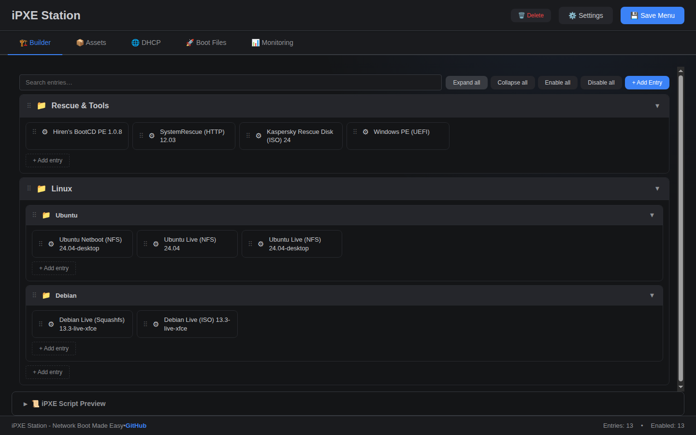
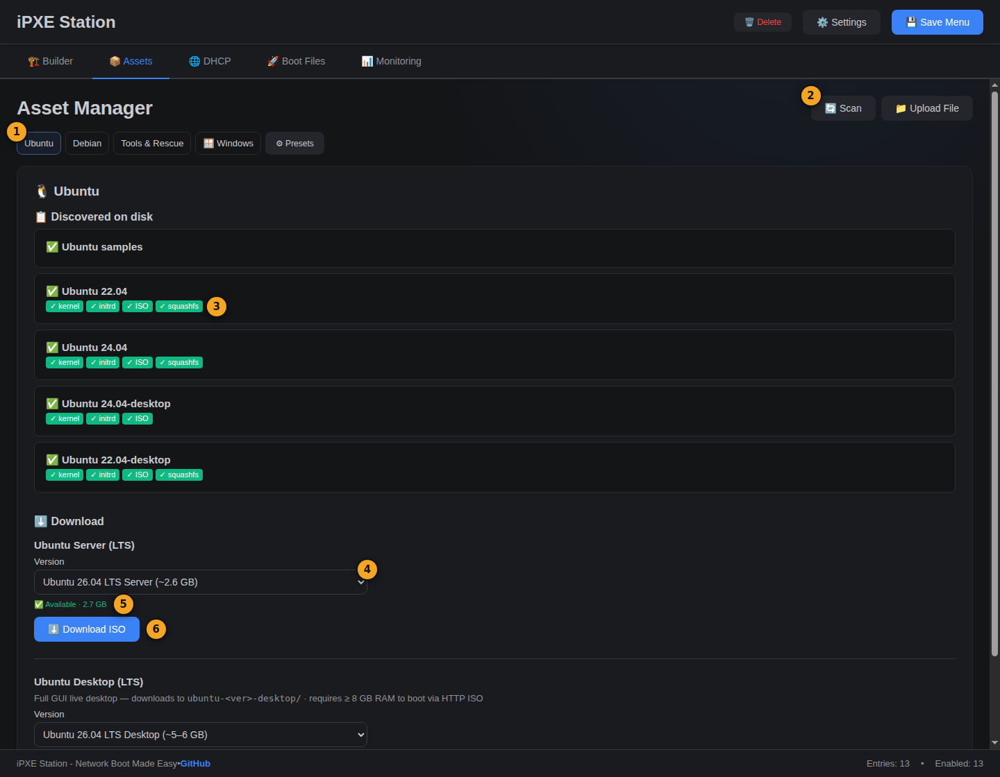
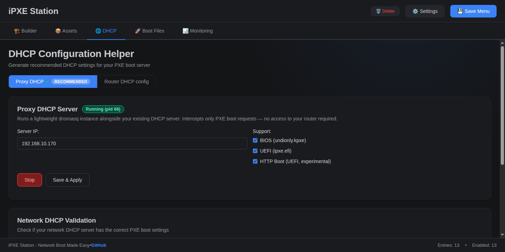
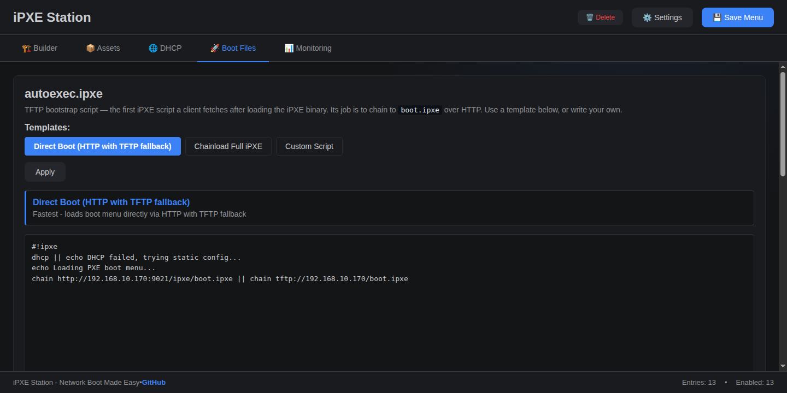
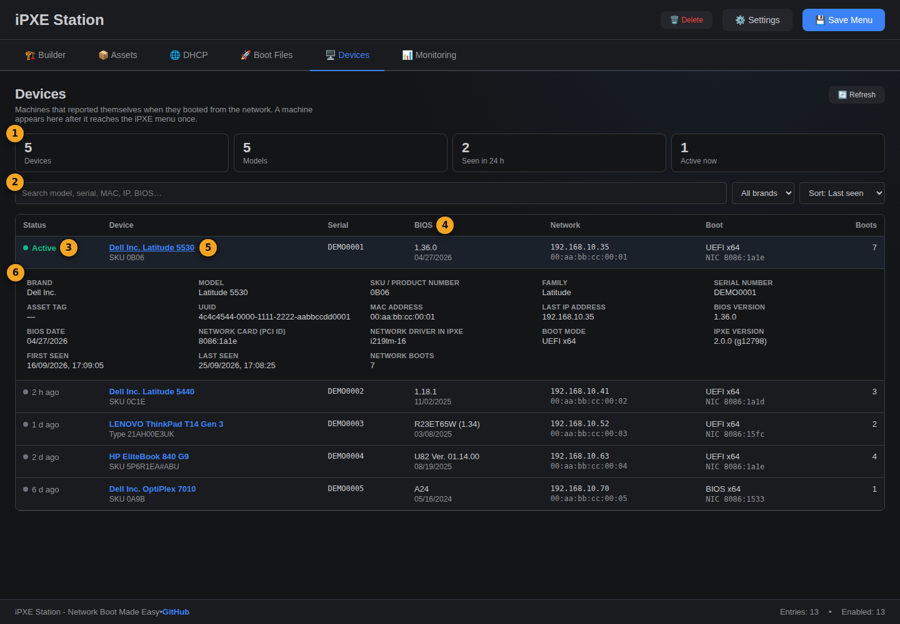

# iPXE Station

**iPXE Station** is a self-hosted PXE/iPXE boot server with a modern web interface. It handles the full workflow: downloading distro assets, building hierarchical boot menus, and configuring DHCP — all without touching config files manually.

## ✨ Features

> Screenshots are taken from a running instance. The numbered markers on each screenshot match the
> list underneath it. Click a screenshot to open it full size.

### 🎨 Visual Menu Builder

[](docs/screenshots/builder.png)

1. **Search and bulk actions** — filter entries, expand or collapse groups, enable or disable everything; **+ Add Entry** opens the scenario wizard
2. **Menu tree** — submenus and entries; drag to reorder or move an entry into another submenu
3. **Kernel and initrd** — filled in by the boot recipe for the chosen scenario and downloaded version
4. **Command-line helper** — merge or replace kernel parameters from ready-made sets
5. **Save Menu** — regenerates `boot.ipxe`; clients pick up the change on their next boot
6. **iPXE Script Preview** — the exact script a client will run

- **Scenario-based wizard** — pick a distro/scenario, choose a downloaded version, and kernel/initrd/cmdline are auto-filled
- **Boot Recipe Engine** — automatically generates correct kernel parameters per distro and boot mode (NFS, HTTP ISO, netboot)
- **Hierarchical menus** — create submenus to organise entries
- **Tree editor** — inline move, delete, disable controls on hover
- **Live preview** — see the generated iPXE script in real time

### 📦 Asset Manager

[](docs/screenshots/assets.png)

1. **Categories** — Ubuntu, Debian, Tools & Rescue, Windows, and Presets
2. **Scan** refreshes the catalog of local assets; **Upload File** adds your own
3. **Discovered on disk** — shows which parts of each version are present (kernel, initrd, ISO, squashfs), so you know which boot modes will work
4. **Version picker** — versions come from the official release servers
5. **Availability check** — confirms the download URL works and shows its size before you start
6. **Download ISO** — downloads with a progress bar and extracts the ISO for network boot

- **Ubuntu Server & Desktop LTS** — dynamic version picker, downloads directly from releases.ubuntu.com
- **SystemRescue, Kaspersky Rescue Disk, Debian** — version pickers with direct ISO/netboot downloads
- **Automatic ISO extraction** — ISOs are extracted in-place for network boot
- **Real-time progress bars** — per-file progress (kernel, initrd, ISO) with GB counter
- **Upload & catalog scan** — upload any file, scan local assets

### 🌐 DHCP Configuration

[](docs/screenshots/dhcp.png)

1. **Mode** — Proxy DHCP (recommended, no router changes) or Router DHCP config (ready-to-paste settings)
2. **Status** of the built-in dnsmasq proxy
3. **Client types** to answer: BIOS (`undionly.kpxe`) and UEFI (`ipxe.efi`)
4. **UEFI HTTP Boot** (experimental) — see the note below
5. **Save & Apply** — stores the settings and applies them to the running proxy
6. **Network DHCP Validation** — sends real DHCP probes and explains what is wrong

- **Proxy DHCP server** — built-in dnsmasq in proxy mode (BIOS + EFI), starts automatically on container restart
- **Config generator** — ready-to-paste configs for dnsmasq, ISC DHCP, MikroTik RouterOS, Windows Server
- **Network validator** — sends real DHCP probes (BIOS, UEFI, iPXE) and diagnoses the result with fix suggestions
- **UEFI HTTP Boot (Experimental)** — optional toggle (Proxy DHCP panel, and the dnsmasq router-config
  generator) that answers RFC 5970 `HTTPClient` requests with a URL to `ipxe.efi` instead of a TFTP
  filename. Off by default; see [ROADMAP.md](ROADMAP.md) for the validation checklist — unverified
  against real HTTPClient-capable UEFI firmware.

### 🔧 Boot Files

[](docs/screenshots/boot-files.png)

1. **autoexec.ipxe templates** — Direct Boot, Chainload Full iPXE, or your own script
2. **Editor** for the first script a client fetches over TFTP
3. **Save** writes the file to the TFTP root
4. **Preseed profiles** — the ★ marks the active profile, served at `/preseed.cfg`
5. **Templates** for new profiles (Debian Minimal, Debian Desktop)
6. **Editor** for the selected preseed profile

- **autoexec.ipxe editor** — edit or apply templates directly from the UI
- **Preseed profiles** — create, activate, and serve Debian unattended install templates from the UI
- **NFS boot** — Ubuntu Server NFS cmdline with auto-detected export path

### 🖥️ Devices

[](docs/screenshots/devices.png)

*Sample data.*

1. **Summary** — devices known, models, seen in the last 24 hours, active in the last 5 minutes
2. **Search, brand filter, sort** — by model, serial number, MAC, IP, BIOS version or UUID
3. **Status** — *Active* while a machine is booting, otherwise how long ago it was seen
4. **BIOS** — version and date at a glance, so outdated machines stand out
5. **Click a name** to open the full record of that machine
6. **Details** — SKU, serial number, UUID, MAC, network card id, boot mode, first and last seen

- **Reported by the machine itself** when it reaches the iPXE menu (SMBIOS), so no operating system or agent
  is needed; a blank machine shows up too. See
  [what the server learns about a client](docs/how-it-works.md#what-the-server-learns-about-a-client).
- **Readable names** — HP's repeated brand is collapsed and Lenovo shows its ThinkPad name with the machine
  type underneath.
- **Kept on your server** in `data/srv/ipxe/clients.json`; the same list is available at
  `GET /api/monitoring/clients`.

### 📊 Monitoring
- Live boot event log
- **Client info** — each booting machine reports its brand, model, serial, BIOS version, MAC and NIC
  (see [how it works](docs/how-it-works.md#what-the-server-learns-about-a-client))
- Syslog stream
- Service status (TFTP, HTTP, dnsmasq)

---

## 📚 Documentation

| | |
|---|---|
| [How it works](docs/how-it-works.md) | Components, ports, and what happens from F12 to the menu |
| [Boot methods](docs/boot-methods.md) | BIOS PXE, UEFI PXE, HTTP Boot, Secure Boot, Linux and WinPE modes: what is verified |
| [Typical scenarios](docs/scenarios.md) | Rescue toolkit, live Linux, unattended Debian, your own WinPE automation |
| [Troubleshooting](docs/troubleshooting.md) | Client does not boot, falls back to another device, WinPE cannot see the disk |
| [WinPE provisioning example](examples/winpe-provision/README.md) | Scripts and guide for running your own automation in a network-booted WinPE |
| [Roadmap](ROADMAP.md) | What works, what is unverified, what is planned |

---

## 📋 Requirements

- **Docker** and Docker Compose
- **Disk space**: 5–10 GB typical (20+ GB with Desktop ISOs)
- **Ports**: 9021 (HTTP/UI), 69 (TFTP), 67 (DHCP — only if using Proxy DHCP)
- **Capability**: `NET_ADMIN` for DHCP validation and Proxy DHCP (already in `docker-compose.yml`)

### Security Scope (Current Stage)

- iPXE Station is currently designed for **trusted LAN** usage.
- Full authentication/authorization is **not required** for local development at this stage —
  the default deployment (`SECURITY_MODE=off`) is unchanged.
- **Optional token auth** is available: set `SECURITY_MODE=token` and `API_TOKEN=<long-random-value>`
  in `docker-compose.yml`, then paste the same token into **Settings → API Token** in the UI
  (only shown when the frontend is built with `VITE_SECURITY_MODE=token`) or set `VITE_API_TOKEN`
  at build time. All `/api/*` routes then require `Authorization: Bearer <token>`.
- **SSRF protection** is built in: asset download/URL-check endpoints reject loopback, link-local,
  private, and other non-public targets, and re-validate redirects before following them.

---

## 🚀 Quick Start

```bash
git clone https://github.com/loglux/ipxe-station.git
cd ipxe-station
docker compose up -d --build
```

Open **http://localhost:9021/ui**

### Download a distro

1. **Assets** tab → Quick Download
2. Select Ubuntu Server/Desktop or SystemRescue version
3. Click **Download ISO** — extraction happens automatically
4. ISO contents appear in the catalog when done

### Create a boot menu entry

1. **Builder** tab → click **+ Add Entry**
2. Pick category → scenario (e.g. *Ubuntu Live*)
3. Select downloaded version → boot mode auto-selected (NFS / HTTP ISO)
4. Click **Create** — kernel, initrd and cmdline are filled automatically
5. **💾 Save Menu**

### Configure DHCP

1. **DHCP** tab → select your server type
2. Copy the generated config to your DHCP server
3. Or use **Proxy DHCP** — enable it directly in the UI (no router changes needed)

---

## 🌐 Access Points

| Service | URL |
|---------|-----|
| Web UI | http://localhost:9021/ui |
| API docs | http://localhost:9021/docs |
| iPXE boot script | http://localhost:9021/ipxe/boot.ipxe |
| TFTP | tftp://localhost:69 |

---

## 🎯 Supported Scenarios

### 🐧 Linux
| Scenario | Description |
|----------|-------------|
| Ubuntu Server Live | Server ISO boot — NFS (recommended) or HTTP ISO |
| Ubuntu Desktop Live | Desktop ISO boot — NFS or HTTP ISO (≥ 8 GB RAM) |
| Ubuntu Preseed | Automated server install |
| Debian Netboot | Interactive network installer |
| Debian Preseed | Automated Debian Installer via preseed.cfg |
| Debian Live (Experimental) | Prototype live-boot path via ISO or squashfs fetch |

### 🛠️ Rescue & Tools
| Scenario | Description |
|----------|-------------|
| SystemRescue | Recovery environment, HTTP boot |
| Kaspersky Rescue Disk | KRD 18 (netboot) and KRD 24 (ISO fetch) |
| Hiren's BootCD PE | Windows PE toolkit, booted with wimboot |
| GParted Live | Partition editor and disk maintenance (official PXE or ISO) |
| Clonezilla Live | Disk imaging and cloning (manual ISO) |
| Memtest86+ | Memory testing |

### 🪟 Windows
| Scenario | Description |
|----------|-------------|
| Windows PE | Your own WinPE via wimboot — see [Windows PE](#windows-pe-wimboot) below |

### 📂 Organisation
- **Submenu** — group related entries
- **Separator** — visual divider

### ⚙️ Actions
- Reboot, iPXE Shell, Exit to BIOS, Chain to another bootloader, Custom entry

---

## 📁 Directory Structure

```
./data/srv/
├── tftp/                    # TFTP boot files (port 69)
│   ├── undionly.kpxe        # BIOS iPXE loader
│   ├── ipxe.efi             # UEFI iPXE loader
│   └── autoexec.ipxe        # Bootstrap — chains to HTTP menu
├── http/                    # HTTP assets (/http/)
│   ├── ubuntu-22.04/        # Ubuntu 22.04 Server (extracted ISO)
│   ├── ubuntu-24.04-desktop/ # Ubuntu 24.04 Desktop (extracted ISO)
│   ├── rescue-12.03/        # SystemRescue
│   └── debian-12/           # Debian netboot files
├── ipxe/                    # iPXE scripts (/ipxe/, no-cache)
│   └── boot.ipxe            # Generated boot menu
└── dhcp/                    # Generated DHCP configs
```

---

## ⚙️ Configuration

### Environment Variables (`docker-compose.yml`)

```yaml
environment:
  - PXE_SERVER_IP=192.168.1.100   # Your server's IP address
  - HTTP_PORT=9021
  - TFTP_PORT=69
  # - SECURITY_MODE=token          # off (default) or token
  # - API_TOKEN=change-me          # required when SECURITY_MODE=token
```

### Production vs. Development

`docker-compose.yml` is the production-safe default (no hot-reload, no source bind-mount). For local
development, layer the dev override:

```bash
docker compose -f docker-compose.yml -f docker-compose.dev.yml up -d --build
# or, using the deploy helper:
DEV=1 ./deploy.sh start
```

This adds `UVICORN_RELOAD=1` and a read-only `./app:/app` bind-mount so backend edits apply instantly.

### NFS Boot (Ubuntu Server)

For NFS boot mode, configure the NFS export on your host:

```bash
sudo bash scripts/setup-nfs.sh
```

Then set the export path in **Settings → NFS Boot Root**.

### Debian Preseed

For automated Debian installs, manage one or more preseed profiles in the
**Boot Files** tab. The active profile is exposed at:

```text
http://SERVER:9021/preseed.cfg
```

Named profiles are also available at:

```text
http://SERVER:9021/preseed/PROFILE.cfg
```

### Windows PE (wimboot)

Boot your own Windows PE image over HTTP with [wimboot](https://ipxe.org/wimboot). The container
ships a pinned, SHA256-verified `wimboot` in `/srv/http/wimboot`. Put the WinPE files, taken from
your ADK-built WinPE media, in one folder under `data/srv/http/`, for example `winpe/`:

| File | Source |
|------|--------|
| `boot.wim` | your WinPE image (`sources\boot.wim`) |
| `BCD` | `EFI\Microsoft\Boot\BCD` for UEFI clients (`Boot\BCD` for BIOS) |
| `boot.sdi` | `Boot\boot.sdi` |

Then in **Builder → Add Entry → Windows PE** use kernel `wimboot` and initrd
`winpe/BCD winpe/boot.sdi winpe/boot.wim`. The generated script passes each file to `wimboot`
under its plain name (`BCD`, `boot.sdi`, `boot.wim`).

Things to know:
- The whole WIM is loaded into the client's RAM; allow at least 2–4 GB.
- **Secure Boot:** the stock iPXE binaries are not signed, so clients with Secure Boot enabled will not
  start them (`wimboot` itself is Microsoft-signed). Turn Secure Boot off for provisioning or see
  [ROADMAP.md](ROADMAP.md) §8 for the signing plan.
- **RAID/VMD laptops:** if the internal disk is not visible in WinPE, the SATA mode is probably
  "RAID On" (Intel RST/VMD). Add the Intel RST VMD storage driver to the WIM (`DISM /Add-Driver`)
  or load it at runtime with `drvload`.
- Everything under `data/srv/http/` is downloadable by anyone on the network. Keep passwords and
  keys out of the WinPE image and its scripts.

To run your own automation once WinPE is up (detect the model, fetch a per-model package, load
drivers, start a script), see the [WinPE provisioning example](examples/winpe-provision/README.md).

### Debian Live Research Status

Debian publishes official Live install images separately from installer media, and they
are explicitly positioned as "live install" images with Calamares on 64-bit PC systems.
iPXE Station now exposes Debian Live as an experimental scenario so the path can be
prototyped, but it is still not treated as a validated production mode.

The current prototype follows Debian `live-boot` documentation:
- `boot=live` is required
- `fetch=` can use an HTTP URL to `filesystem.squashfs`
- `fetch=` may also use a Live ISO in place of the squashfs image
- IP-based URLs are preferred inside early boot environments

Manual validation checklist:
1. Boot a BIOS client with Debian Live ISO fetch and confirm the menu reaches `live-boot`.
2. Boot a UEFI client with the same ISO path and compare behavior.
3. Repeat with squashfs fetch against `live/filesystem.squashfs`.
4. Record RAM usage, download time, and whether network comes up automatically.
5. Capture final working and failing cmdlines before promoting the mode beyond experimental.

Research basis:
- Debian download/install split: [Download Debian](https://www.debian.org/distrib/)
- Debian Live images: [Live install images](https://www.debian.org/CD/live/)
- Debian preseed boot parameters: [Installer appendix B.2](https://www.debian.org/releases/trixie/amd64/apbs02.en.html)
- Debian live-boot parameters: [live-boot(7)](https://manpages.debian.org/bookworm/live-boot-doc/live-boot.7.en.html)
- iPXE preseed appnote: [Debian preseed](https://ipxe.org/appnote/debian_preseed)

---

## 🏗️ Architecture

Working principles for delivery and future extensibility are documented in
`ROADMAP.md` under **Execution Principles**.

```
┌──────────────────────────────────────────────┐
│  React Frontend (Vite + React 18)            │
│  Menu Builder · Asset Manager · DHCP Helper  │
│  Boot Files · Monitoring · Settings          │
└──────────────────┬───────────────────────────┘
                   │ REST API
┌──────────────────┴───────────────────────────┐
│  FastAPI Backend                             │
│  iPXE generator · Boot Recipe Engine        │
│  Asset downloader/extractor · DHCP helper   │
│  Proxy DHCP (dnsmasq) · File serving        │
└──────────────────┬───────────────────────────┘
                   │
┌──────────────────┴───────────────────────────┐
│  Storage (Docker volumes)                    │
│  /srv/tftp  /srv/http  /srv/ipxe  /srv/dhcp  │
└──────────────────────────────────────────────┘
```

---

## 🧪 Development

```bash
python -m venv .venv
./.venv/bin/pip install -r requirements-dev.txt
./.venv/bin/pre-commit install

make format        # black + isort
make backend-lint  # ruff
make backend-test  # pytest (178 tests)
make quality       # all of the above
```

---

## 🔍 Troubleshooting

**PXE boot not working**
1. Check TFTP files: `ls data/srv/tftp/`
2. Verify autoexec.ipxe chains to `/ipxe/boot.ipxe` (not `/tftp/boot.ipxe`)
3. Test: `curl http://SERVER:9021/ipxe/boot.ipxe`
4. Check firewall: ports 69/UDP and 9021/TCP must be open

**DHCP validation fails**
- Container needs `NET_ADMIN` capability (already set in `docker-compose.yml`)
- Validation is optional — config generation works without it

**autoexec.ipxe gets corrupted**
- Never write it via bash heredoc (`!` gets escaped by bash history expansion)
- Use the Boot Files tab in the UI, or `docker cp` a pre-written file

**Ubuntu boots to console instead of desktop**
- Server ISO → always CLI (correct)
- For Desktop GUI: download Ubuntu Desktop ISO via Assets tab (separate from Server)

---

## 📝 License

MIT — see [LICENSE](LICENSE)
