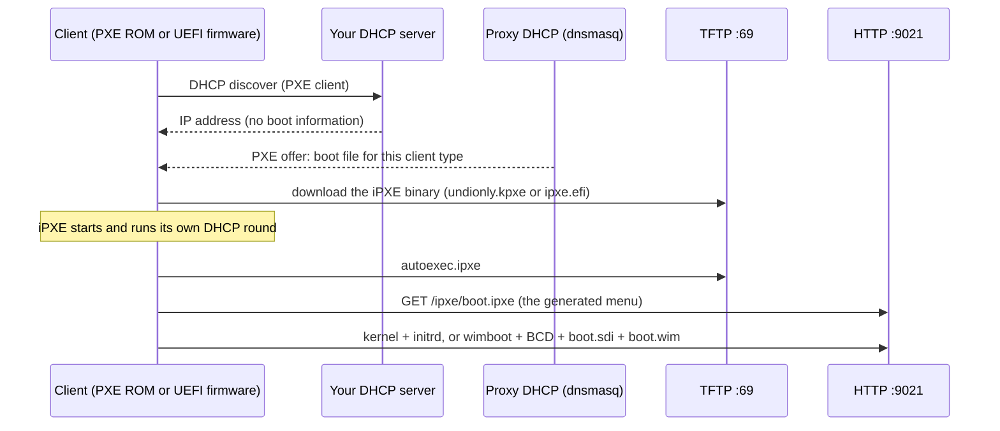

# How iPXE Station works

## The pieces

| Piece | Where | Port | Role |
|-------|-------|------|------|
| Web UI (React) and API (FastAPI) | container | 9021 `/ui`, `/api`, `/docs` | Build menus, manage assets, configure DHCP |
| HTTP file server | same process | 9021 | `/ipxe/` (generated menu, no-cache), `/http/` (kernels, ISOs, WinPE files), `/tftp/`, `/preseed*.cfg` |
| TFTP server | container | 69/udp | The first iPXE binary and `autoexec.ipxe` |
| Proxy DHCP (dnsmasq) | container, optional | 67/udp, 4011/udp | Tells PXE clients which boot file to fetch, without touching your DHCP server |
| Storage | `./data/srv/{tftp,http,ipxe,dhcp}` on the host | | Everything you add or generate; survives container rebuilds |

The container runs with host networking so DHCP and TFTP see the LAN directly.

## From F12 to the menu

1. The client's firmware broadcasts a DHCP request marked as a PXE client.
2. Your normal DHCP server hands out an IP address. The **proxy DHCP** server answers the same
   request with only the boot information, so no router changes are needed. (If you prefer, the DHCP
   tab generates settings for dnsmasq, ISC DHCP, MikroTik or Windows Server instead.)
3. The client downloads the iPXE binary over TFTP: `undionly.kpxe` for BIOS, `ipxe.efi` for UEFI.
4. iPXE starts and fetches `autoexec.ipxe` (from TFTP). That small script only chains to the real menu
   over HTTP, with a TFTP fallback.
5. `boot.ipxe` is the menu generated from your Builder entries. Choosing an entry downloads the kernel
   and initrd (or the WinPE files) over HTTP and boots them.

## From the Builder to `boot.ipxe`

The Builder edits a menu model that the backend stores as `data/srv/ipxe/menu.json`. **Save Menu**
validates it, generates the iPXE script into `data/srv/ipxe/boot.ipxe` (served at `/ipxe/boot.ipxe`),
and refreshes a small `boot.ipxe` stub in the TFTP root that chains to the HTTP menu. The previous
`menu.json` is kept as `menu.json.bak`.

The **Boot Recipe Engine** fills kernel, initrd and command line for each distro, version and boot
mode (for example Ubuntu over NFS versus HTTP ISO), so you do not write kernel parameters by hand.
The backend is the source of truth for these recipes; the UI only renders them.

## Proxy DHCP details

The generated dnsmasq configuration (Proxy DHCP tab) uses `pxe-service` lines, one per client type:

| Client | Answer |
|--------|--------|
| BIOS, not yet iPXE | `undionly.kpxe` |
| BIOS, already running iPXE | `autoexec.ipxe` |
| UEFI x86-64 (and 32-bit) | `ipxe.efi` |
| UEFI HTTP Boot (`HTTPClient`, optional, experimental) | a URL to `ipxe.efi` over HTTP |

Things learned while building it (also in [ROADMAP](../ROADMAP.md)):

- Use `pxe-service`, not `dhcp-boot`: only `pxe-service` sends both the offer and the acknowledgement
  in proxy mode.
- Do not use `dhcp-no-override`; it stops dnsmasq from filling the boot fields.
- Kernel and initrd are loaded over HTTP, not NFS: the iPXE binaries do not include NFS support. NFS
  is used later, by the booted Linux itself, to read its root filesystem.

## What the server learns about a client

Two sources, both visible in the **Monitoring** log:

**1. DHCP (always).** The proxy DHCP log shows every DHCP request on the LAN, PXE or not:

| Seen | Meaning |
|------|---------|
| MAC address | Which NIC asked |
| Vendor class `PXEClient:Arch:00007:UNDI:003016` | A PXE client; `Arch:00007` is UEFI x86-64, `Arch:00000` is legacy BIOS |
| Client machine id (option 97) | The SMBIOS UUID; on Dell it starts with `44454c4c` ("DELL") |
| Client name (option 12) | The hostname the OS or WinPE announces, e.g. `Latitude5530` or `minint-xxxx` |
| User class `iPXE` | The request came from iPXE, not the firmware |

This tells you *that* a machine is there and roughly what it is, but the name is whatever the OS chose.

**2. iPXE report (`/client-info`).** At the top of the generated menu, iPXE sends what the machine
says about itself. It is failure-tolerant: an unreachable server never blocks the menu.

| Field | Source |
|-------|--------|
| Brand, model, serial, asset tag | SMBIOS system and chassis information |
| SKU / product number, family | SMBIOS system information (Dell and HP fill the SKU; Lenovo puts the friendly model name in *version* and a machine-type code in *product*) |
| BIOS version and date | SMBIOS BIOS information |
| UUID, MAC | SMBIOS and the NIC iPXE booted from |
| NIC PCI id (`8086:1a1c`) and driver | The network device iPXE used |
| Boot mode and architecture | iPXE build (`efi` / `pcbios`, `x86_64`) |

Each report becomes one log line, for example
`Client info: Dell Inc. Latitude 5530 (SKU 0B3D, serial ABC1234, BIOS 1.20.0, MAC 00:be:..., NIC 8086:1a1c, efi x86_64)`,
and updates a persistent client list (`data/srv/ipxe/clients.json`, one record per machine, keyed by UUID
or MAC). The list is available at `GET /api/monitoring/clients`.

Things to know:

- The values come from the machine itself and are **not authenticated**. Treat them as hints. The
  server cleans them (printable text, bounded length) and caps the list at 2000 machines.
- `/client-info` is deliberately open, because iPXE cannot present an API token. In token mode the
  client *list* stays protected; the *report* endpoint does not.
- Serial numbers and UUIDs identify hardware; they stay on your server, in the log and in `clients.json`.
- The SMBIOS fields SKU, family and BIOS version use raw SMBIOS offsets and have not yet been checked
  against real machines; if a field comes back empty, the machine does not provide it (or the offset
  is wrong for it).

## Security model

Designed for a trusted LAN. By default there is no authentication. Set `SECURITY_MODE=token` and
`API_TOKEN` to require a bearer token on `/api/*` (the served boot files stay open, because clients
must fetch them without credentials). Asset downloads reject loopback, private and other non-public
targets (SSRF guard), and the `wimboot` binary is pinned and hash-checked at build time.
