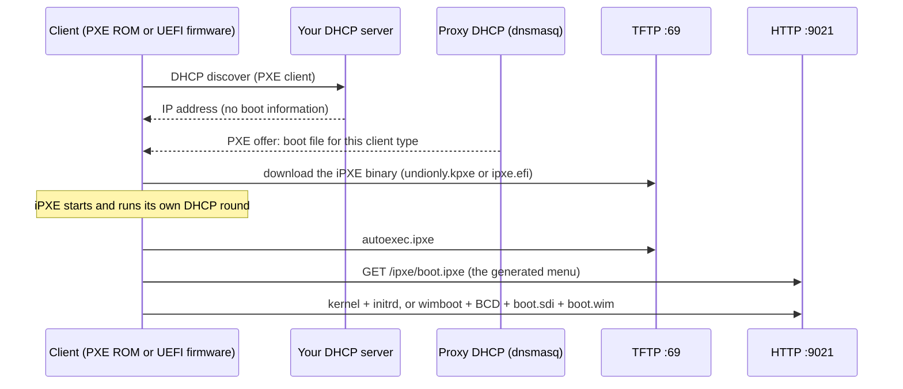

# How iPXE Station works

## The pieces

| Piece | Where | Port | Role |
|-------|-------|------|------|
| Web UI (React) and API (FastAPI) | container | 9021 `/ui`, `/api`, `/docs` | Build menus, manage assets, configure DHCP |
| HTTP file server | same process | 9021 | `/ipxe/` (generated menu, no-cache), `/http/` (kernels, ISOs, WinPE files), `/tftp/`, `/preseed*.cfg` |
| TFTP server | container | 69/udp | The first iPXE binary and `autoexec.ipxe` |
| Proxy DHCP (dnsmasq) | container, optional | 67/udp, 4011/udp | Tells PXE clients which boot file to fetch, without touching your DHCP server |
| Storage | `./data/srv/{tftp,http,ipxe,dhcp}` on the host | | Everything you add or generate; survives container rebuilds |

The container runs with host networking so DHCP and TFTP see the LAN directly.

## From F12 to the menu


```mermaid
sequenceDiagram
    participant C as Client (PXE ROM or UEFI firmware)
    participant D as Your DHCP server
    participant P as Proxy DHCP (dnsmasq)
    participant T as TFTP :69
    participant H as HTTP :9021
    C->>D: DHCP discover (PXE client)
    D-->>C: IP address (no boot information)
    P-->>C: PXE offer: boot file for this client type
    C->>T: download the iPXE binary (undionly.kpxe or ipxe.efi)
    Note over C: iPXE starts and runs its own DHCP round
    C->>T: autoexec.ipxe
    C->>H: GET /ipxe/boot.ipxe (the generated menu)
    C->>H: kernel + initrd, or wimboot + BCD + boot.sdi + boot.wim
```

1. The client's firmware broadcasts a DHCP request marked as a PXE client.
2. Your normal DHCP server hands out an IP address. The **proxy DHCP** server answers the same
   request with only the boot information, so no router changes are needed. (If you prefer, the DHCP
   tab generates settings for dnsmasq, ISC DHCP, MikroTik or Windows Server instead.)
3. The client downloads the iPXE binary over TFTP: `undionly.kpxe` for BIOS, `ipxe.efi` for UEFI.
4. iPXE starts and fetches `autoexec.ipxe` (from TFTP). That small script only chains to the real menu
   over HTTP, with a TFTP fallback.
5. `boot.ipxe` is the menu generated from your Builder entries. Choosing an entry downloads the kernel
   and initrd (or the WinPE files) over HTTP and boots them.

## From the Builder to `boot.ipxe`

The Builder edits a menu model that the backend stores as `data/srv/ipxe/menu.json`. **Save Menu**
validates it, generates the iPXE script into `data/srv/ipxe/boot.ipxe` (served at `/ipxe/boot.ipxe`),
and refreshes a small `boot.ipxe` stub in the TFTP root that chains to the HTTP menu. The previous
`menu.json` is kept as `menu.json.bak`.

The **Boot Recipe Engine** fills kernel, initrd and command line for each distro, version and boot
mode (for example Ubuntu over NFS versus HTTP ISO), so you do not write kernel parameters by hand.
The backend is the source of truth for these recipes; the UI only renders them.

## Proxy DHCP details

The generated dnsmasq configuration (Proxy DHCP tab) uses `pxe-service` lines, one per client type:

| Client | Answer |
|--------|--------|
| BIOS, not yet iPXE | `undionly.kpxe` |
| BIOS, already running iPXE | `autoexec.ipxe` |
| UEFI x86-64 (and 32-bit) | `ipxe.efi` |
| UEFI HTTP Boot (`HTTPClient`, optional, experimental) | a URL to `ipxe.efi` over HTTP |

Things learned while building it (also in [ROADMAP](../ROADMAP.md)):

- Use `pxe-service`, not `dhcp-boot`: only `pxe-service` sends both the offer and the acknowledgement
  in proxy mode.
- Do not use `dhcp-no-override`; it stops dnsmasq from filling the boot fields.
- Kernel and initrd are loaded over HTTP, not NFS: the iPXE binaries do not include NFS support. NFS
  is used later, by the booted Linux itself, to read its root filesystem.

## The menu is built for each machine

`boot.ipxe` is a small script. Its first line asks the server for a menu built for the machine that is
booting, sending what the machine reports about itself (the same data as in the Devices tab):

```
chain http://SERVER:9021/ipxe/menu?mac=...&manufacturer=...&product=...  && exit || goto start
```

The server records the machine, checks it against the **scenarios**, and answers with the normal menu plus:

- a **Recommended for Dell Inc. Latitude 5530** block with the scenarios that match this machine;
- a **Device information** item that prints brand, model, SKU, serial number, BIOS, network card, MAC, boot
  mode and IP on the machine's own screen;
- optionally, one **automatic** scenario pre-selected with a 15 second countdown (any key or another choice
  cancels it). An *offered* scenario never starts on its own: when a machine has recommendations and no
  automatic one, the menu waits for the operator instead of counting down to its first item.

**If the server cannot answer** (no saved menu, server down, an error in the personal menu), the ordinary menu
that follows in `boot.ipxe` is used, so a machine is never left without a menu.

### Scenarios

A scenario says which machines it applies to and which existing menu entry it points to. They live in
`data/srv/ipxe/scenarios.json` and can be read and replaced through the API (`GET` / `PUT /api/scenarios`;
`GET /api/scenarios/preview/<device id>` shows what a known machine would get):

```json
{
  "scenarios": [
    {
      "id": "live-latitude-5530",
      "title": "Live system: Kaspersky Rescue Disk",
      "match": { "manufacturer": "Dell*", "product": "Latitude 5530" },
      "entry": "kaspersky_1",
      "mode": "offer"
    }
  ]
}
```

| Field | Meaning |
|-------|---------|
| `id`, `title`, `description` | Name shown in the menu and the lists |
| `match` | Field → pattern; **all** must match. Fields: `manufacturer`, `product`, `sku`, `family`, `serial`, `uuid`, `mac`, `platform`, `arch`, `nic_pci`. `*` and `?` are wildcards, case does not matter. `*` also accepts a field the machine did not report; `?*` requires a value |
| `entry` | Name of an enabled menu entry (a boot, chain or submenu entry) |
| `mode` | `offer` (listed in the recommended block) or `auto` (pre-selected with a countdown; needs a `match`; only the first automatic scenario applies) |
| `enabled` | Turn a scenario off without deleting it |

`PUT` refuses duplicate ids and entries that do not exist. A broken item in the file is skipped instead of
hiding the others. The Devices tab shows the scenarios that apply to each machine.

**Safety.** Everything a machine reports is untrusted. Before it is printed in a script, text is reduced to a
small safe set (letters, digits and a few punctuation marks): `||`, `&&`, `${...}` and line breaks from a
machine cannot become commands. The values also decide which scenarios match, so a machine that lies about
itself can only pick a different *recommendation*; keep anything destructive behind a per-serial allow-list.
`/ipxe/menu` is open like `boot.ipxe` because iPXE cannot present a token; the scenarios API is behind the
token boundary.

## What the server learns about a client

Two sources, both visible in the **Monitoring** log:

**1. DHCP (always).** The proxy DHCP log shows every DHCP request on the LAN, PXE or not:

| Seen | Meaning |
|------|---------|
| MAC address | Which NIC asked |
| Vendor class `PXEClient:Arch:00007:UNDI:003016` | A PXE client; `Arch:00007` is UEFI x86-64, `Arch:00000` is legacy BIOS |
| Client machine id (option 97) | The SMBIOS UUID; on Dell it starts with `44454c4c` ("DELL") |
| Client name (option 12) | The hostname the OS or WinPE announces, e.g. `Latitude5530` or `minint-xxxx` |
| User class `iPXE` | The request came from iPXE, not the firmware |
| Vendor class `Linux ipconfig` | A live Linux system's own initramfs asking for an address: the client got as far as booting its kernel |

This tells you *that* a machine is there and roughly what it is, but the name is whatever the OS chose.

**2. iPXE report (`/client-info`).** At the top of the generated menu, iPXE sends what the machine
says about itself. It is failure-tolerant: an unreachable server never blocks the menu.

| Field | Source |
|-------|--------|
| Brand, model, serial, asset tag | SMBIOS system and chassis information |
| SKU / product number, family | SMBIOS system information (Dell and HP fill the SKU; Lenovo puts the friendly model name in *version* and a machine-type code in *product*) |
| BIOS version and date | SMBIOS BIOS information |
| UUID, MAC | SMBIOS and the NIC iPXE booted from |
| NIC PCI id (`8086:1a1c`) and driver | The network device iPXE used |
| Boot mode and architecture | iPXE build (`efi` / `pcbios`, `x86_64`) |

Each report becomes one log line, for example
`Client info: Dell Inc. Latitude 5530 (SKU 0B3D, serial ABC1234, BIOS 1.20.0, MAC 00:be:..., NIC 8086:1a1c, efi x86_64)`,
and updates a persistent client list (`data/srv/ipxe/clients.json`, one record per machine, keyed by UUID
or MAC). The list is shown in the **Devices** tab and available at `GET /api/monitoring/clients`.

Things to know:

- The values come from the machine itself and are **not authenticated**. Treat them as hints. The
  server cleans them (printable text, bounded length) and caps the list at 2000 machines.
- `/client-info` is deliberately open, because iPXE cannot present an API token. In token mode the
  client *list* stays protected; the *report* endpoint does not.
- Serial numbers and UUIDs identify hardware; they stay on your server, in the log and in `clients.json`.
- Checked on a Dell Latitude 5530: brand, model, SKU, family, serial, BIOS version and date, MAC, UUID
  and the NIC (`8086:1a1e`, driver `i219lm-16`) all arrive correctly. Other vendors fill SMBIOS
  differently (see the table); an empty field means that machine does not provide it. Note that the
  container's HTTP access log also contains the full report (serial and UUID included).

## Security model

Designed for a trusted LAN. By default there is no authentication. Set `SECURITY_MODE=token` and
`API_TOKEN` to require a bearer token on `/api/*` (the served boot files stay open, because clients
must fetch them without credentials). Asset downloads reject loopback, private and other non-public
targets (SSRF guard), and the `wimboot` binary is pinned and hash-checked at build time.
