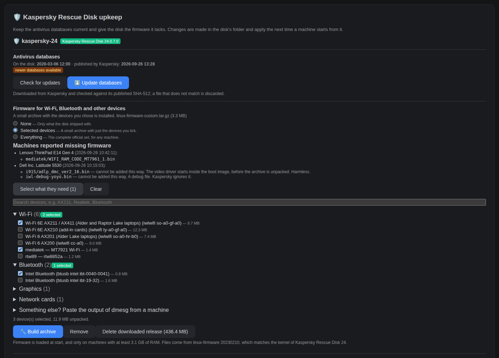
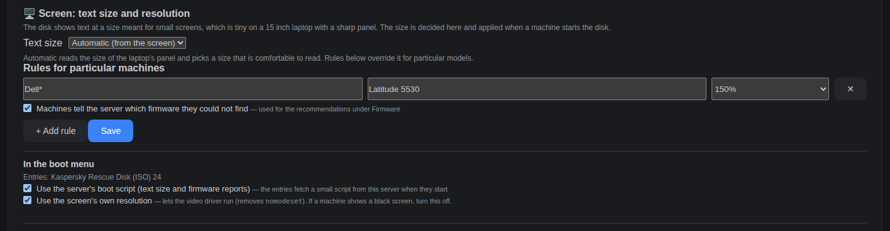

# Kaspersky Rescue Disk

How iPXE Station boots Kaspersky Rescue Disk (KRD) 24 and keeps it useful: fresh antivirus databases,
firmware for the devices of your machines, and a readable screen. Everything is set on the server, in
**Assets** → *Tools & Rescue* → **Kaspersky Rescue Disk upkeep**; nothing is written to the disk image and
nothing is configured by hand on the client.

| Part | What it does | Checked on hardware (Dell Latitude 5530) |
|------|--------------|------------------------------------------|
| [Boot over NFS](#booting-it) | Starts the disk from the server, no USB stick | Yes |
| [Antivirus databases](#antivirus-databases) | Replaces the databases with Kaspersky's current ones | The replacement: yes ("Databases are up to date"). The **Update databases** button and the automatic check: not run for real on a disk that is behind, since the disk was already current |
| [Firmware](#firmware) | Gives the disk Wi-Fi, Bluetooth and other drivers' firmware: none, selected devices, or everything | Selected devices: yes (warning gone); reports from the machine: yes |
| [Screen](#screen-text-size-and-resolution) | Text size and video mode, decided on the server | Fixed 150%, native resolution and Automatic (panel size read from its EDID, 150%): yes. Per-model rules: not yet |

[](screenshots/kaspersky-upkeep.png)

*The upkeep block for one disk (sample data): databases on top, then the firmware modes, what machines reported,
and the device catalog.*

## Booting it

1. **Assets** → *Tools & Rescue* → download Kaspersky Rescue Disk 24 (the ISO is extracted into
   `data/srv/http/kaspersky-24/`).
2. **Builder** → **+ Add Entry** → *Kaspersky Rescue Disk* → **Save Menu**. The entry boots over NFS
   (`sudo bash scripts/setup-nfs.sh` once on the host, then **Settings → NFS Boot Root**).
3. Boot the client by network. UEFI Secure Boot must be off.

The entry carries `BOOTIF=01-${net0/mac:hexhyp}` so the live system uses the wired card that PXE-booted, not
a modem or dock interface ([why](troubleshooting.md), the entry about "NFS over TCP not available").

## Antivirus databases

The disk carries the databases of its release date. Kaspersky publishes newer ones; KRD's own updater replaces one
squashfs module, `live/KRD/30-bases.srm`, and so does this page:

1. **Check for updates** compares the timestamp on the disk (`krd_bases_timestamp.txt`) with `krd.xml` on
   Kaspersky's update server.
2. **Update databases** downloads `42-freshbases.srm`, checks it against the SHA-512 in Kaspersky's `hashes.txt`
   (a file that does not match is discarded and nothing changes), copies the old module, timestamp and
   `sha256sum.txt` to `data/srv/_src/krd-backups/<disk>-bases-<timestamp>/` (the last three are kept), swaps the
   file, and updates the timestamp and the module's line in `sha256sum.txt`.

Do it while no machine is running Kaspersky from the network: a running system reads that file. The page asks
first.

### Automatic check

The **Automatic check of the antivirus databases** card runs the check on a schedule: every day or every week
at a time you set (on the server's clock, which the card shows together with its time zone; a container runs on
UTC unless you set `TZ`). Two actions:

- **Only check**: records whether newer databases are published and shows it on the card. Nothing changes.
- **Check and update**: installs them as the button does. Because a running system reads the file that is
  replaced, the update **waits** if a machine asked for Kaspersky's kernel (or its boot script) within the last
  *N* hours (default 4; 0 turns the wait off). A postponed update is tried again at the next scheduled time.

Turning the schedule on, or changing it, counts from that moment, so saving at 15:00 a run set for 03:00 waits for
tomorrow. A run missed because the server was down is made up once when it is back. **Run now** does the same job
at once. The result of the last run is kept, one line per disk, and every run is written to the system log.

**Roll back:** copy the three files from a backup folder over `live/KRD/30-bases.srm`,
`krd_bases_timestamp.txt` and `sha256sum.txt` of the disk, again while nothing is running from it.

## Firmware

The disk carries almost no firmware, so the Wi-Fi and Bluetooth of many laptops stay dead and KRD shows
*Some hardware does not work correctly* (harmless on a wired network, but untidy). KRD's boot hook unpacks
exactly **one** `linux-firmware-*.tar.gz` from the disk root and runs the `copy-firmware.sh` inside it; that is
the whole mechanism. Choose what the disk gets:

- **None**: only what shipped.
- **Selected devices**: a small archive with the devices you tick, a few MB.
- **Everything**: the complete official release (436 MB). Nothing to think about, but every machine fetches it at
  start, wants 4 GB of RAM and boots a few minutes slower.

### Selected devices

The device list comes from the official linux-firmware release **20230210**, downloaded once (about 436 MB), checked
against kernel.org's checksum and kept on the server in `data/srv/_src/linux-firmware/`. It is never sent to
machines. Its `WHENCE` file says which files belong to which device, which gives about 600 entries, grouped
(Wi-Fi, Bluetooth, graphics, network cards, audio, storage, other) and searchable. Large drivers are split by chip,
and Intel's are named plainly (*Wi-Fi 6E AX211 / AX411*, *Wi-Fi 6 AX200*, ...). Tick your devices and
**Build archive**; it takes seconds. The page opens with what the current archive already holds ticked, because
building **replaces** the archive.

Why release 20230210: KRD 24's kernel (6.1) asks for Wi-Fi firmware API 72, and newer releases dropped it.

### Recommendations from the machines

With the [boot script](#the-boot-script) on, each machine tells the server, about a minute after it starts, which
firmware the kernel could not find. **Machines reported missing firmware** lists them, and **Select what they
need** ticks the matching devices. What is sent is the `dmesg` lines about missing firmware and the few lines the boot script logged about the
screen (see below), only to this server. You can
also paste a machine's `dmesg` output (*Something else?*), or send it by hand:

```
dmesg > /tmp/d.txt; wget -qO- --post-file=/tmp/d.txt http://<server>:9021/api/kaspersky/<disk>/firmware/report
```

### Limits

- **Video firmware cannot be added this way.** On the Latitude 5530, `i915` kept asking for `adlp_dmc` and
  `adlp_guc` although they were in the archive: the video driver is in the boot image and starts before the archive
  is unpacked (`i915.ko` is in KRD 24's initrd; `iwlwifi` and `btusb` are not). It is harmless, KRD itself leaves
  it out of its warning, and the page marks such files instead of recommending them. `iwl-debug-*` files are
  debug files that KRD ignores.
- **RAM.** The hook skips firmware on machines with under about 3 GB.
- **One archive.** More than one `linux-firmware-*.tar.gz` on the disk makes KRD stop at boot, so building or
  installing one removes the other.

## Screen: text size and resolution

KRD's desktop (Cinnamon) shows text at 96 dpi: tiny on a 15 inch laptop with a Full HD or sharper panel. The
**Screen** card sets it from the server:

- **Text size**: *Automatic* (the machine reads its panel's size from the display's EDID and picks a comfortable
  size, in steps of 25%), *Do not change*, or a fixed 125% to 250%.
- **Rules for particular machines**: brand and model (`*` and `?` are wildcards); the first rule that matches wins,
  else the default applies.
- **Use the server's boot script**: adds one argument to the Kaspersky menu entries (below). Nothing happens
  without it.
- **Use the screen's own resolution**: removes `nomodeset` from those entries so the video driver picks the
  panel's resolution. Turn it off if a machine shows a black screen. Without a video driver there is no EDID, so
  *Automatic* falls back to a guess (laptops only, a 15.6 inch panel is assumed).

The value is chosen when the machine asks, so a change applies the next time it starts the disk.

[](screenshots/kaspersky-screen.png)

## The boot script

The Kaspersky menu entries get `live-config.hooks=http://<server>:<port>/ipxe/krd-display.sh?...`. The disk's
live-config downloads it early in boot, as root, before the desktop starts. The server makes it for that machine
(the query carries MAC, brand, model, SKU and family, so rules can match). The script:

1. **Screen**: writes a gsettings override for Cinnamon's `text-scaling-factor` and an `Xft.dpi` resource (Qt
   programs read that one). It logs what it decided to `/var/log/ipxe-station-display.log` on the machine.
2. **Report** (if enabled on the **Screen** card): installs a small autostart entry that, 40 seconds after the
   desktop starts, sends two things to `/ipxe/krd-report`: the missing-firmware lines of `dmesg`, and the lines the
   script logged about the screen (what text size it was asked for, the panel it found and how, whether the kernel
   video driver is on, the size it set). The page shows these under each machine, so you can see what *Automatic*
   decided and from what.

It never fails the boot: on any problem it does nothing. Both endpoints are **open** like `boot.ipxe`, because the
booting disk cannot present a token; see the [security model](how-it-works.md#security-model). The report holds
the model, firmware file names and those screen lines only, is size-limited, cleaned of anything but plain text,
and keeps one entry per machine.

## Where things are

| What | Where |
|------|-------|
| The extracted disk | `data/srv/http/kaspersky-<version>/` |
| Firmware archive on the disk | `data/srv/http/kaspersky-<version>/linux-firmware-*.tar.gz` |
| Downloaded firmware release and catalog | `data/srv/_src/linux-firmware/` (never served) |
| Database backups | `data/srv/_src/krd-backups/` (never served) |
| Screen settings | `data/srv/ipxe/krd-display.json` |
| Automatic check: schedule and last result | `data/srv/ipxe/krd-bases-schedule.json` |
| Reports from machines | `data/srv/ipxe/krd-firmware-reports.json` (the last 20, one per machine) |

`data/srv/_src` must be mounted into the container (it is in `docker-compose.yml`); without it the backups and
the download would be lost when the container is rebuilt.

## API

All under `/api/kaspersky` unless noted, behind the usual token check.

| Call | Purpose |
|------|---------|
| `GET /` | Disks found, with database date and firmware state |
| `GET /{disk}/bases`, `POST /{disk}/bases/update` | Check, and update (a background job) |
| `GET /{disk}/jobs/{bases\|firmware}` | Progress of a job |
| `GET/DELETE /firmware-source`, `POST /firmware-source/download`, `GET /firmware-source/job` | The downloaded release and its catalog |
| `GET /{disk}/firmware` | Archive on the disk and the catalog entries it holds |
| `POST /{disk}/firmware/custom` (`items`, `files`) | Build the small archive |
| `POST /{disk}/firmware/full`, `DELETE /{disk}/firmware` | Install everything, or remove the archive |
| `POST /{disk}/firmware/scan` (`text`) | Missing files (and the entries that cover them) from `dmesg` text |
| `POST /{disk}/firmware/report` | Receive `dmesg` sent by hand |
| `GET/DELETE /firmware-reports` | What machines reported, with recommendations |
| `GET/PUT /schedule`, `POST /schedule/run`, `GET /schedule/job` | The automatic check of the databases |
| `GET/PUT /display`, `GET /display/preview`, `POST /display/menu` | Screen settings, the value a machine would get, and the menu switches |
| `GET /ipxe/krd-display.sh`, `POST /ipxe/krd-report` (**open**, not under `/api`) | Used by the booting disk |

## Not done yet

- Telling a running machine's NFS session from an idle one before replacing the databases.
- Trying per-model rules on hardware.
- The same report-and-recommend idea for other systems ([ROADMAP](../ROADMAP.md)).
